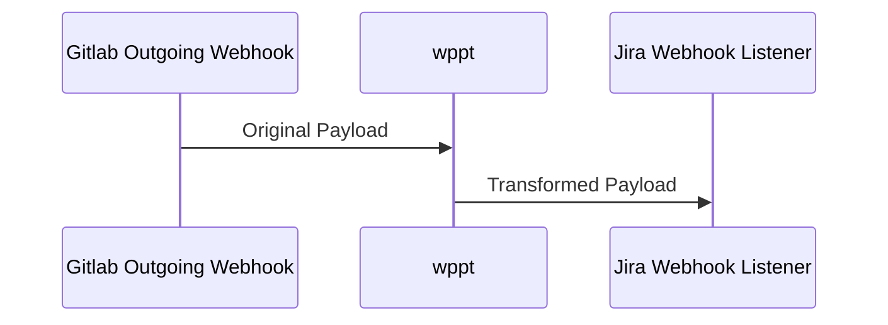

 

# Wppt
#### Webhook Payload Proxy Transformer

## Overview

Wppt *(Pronounced: [**ˈwɪpɪt**])* provides an easy way to intercept, manage, manipulate and re-send a webhook/API call to any Rest API or incoming webhook service (like JIRA).

## Why Is This Needed?

Some services/platforms don't provide an easy-to-use integration vehicle for transforming and syncing requests, payloads and automation e.g. Gitlab -> Jira. Instead of paying for an expensive third-party service to provide integrations you can do this easily yourself on-premise.

## How Does `wppt` Work?

 Wppt leverages Flask dynamic routing. The endpoint is variable and defined via one or multiple yaml files. 
 Based on the endpoint url, `wppt` parses all the yaml files stored on the `transformers` directory, and retrieves the outgoing webhook url and the translations. It then parses all the translations and converts the existing data from the incoming webhook into a new payload structure as defined on the yaml.

### Example:



The corresponding endpoint as defined on the transformer yaml
```yaml
# example.yaml
gitlab2jira:
  enabled: true
  target_webhook: https://example.com/rest/cb-automation/latest/hooks/{JIRA_WEBHOOK_ID}
  translations:
    data:
      name: '[{payload[project][name]}][{payload[object_kind]}] {payload[object_attributes][title]}'
      description: 'Description: {payload[object_attributes][description]}\nURL:{payload[object_attributes][url]}'
```

Given the following incoming webhook payload to the yaml defined endpoint `http://{FQDN}:5005/gitlab2jira/`:
```json
# Incoming Payload
{
    "project":{"name":"landing"}, 
    "object_kind":"story", 
    "object_attributes":{
        "title": "Issue with", 
        "description":"Short description here", 
        "url": "SITE HERE"
    }
}
```

`wppt` will then send an HTTP post request to the `target_webhook` defined on the yaml with the following payload:
```json
# Transformed Payload
{
    "data": {
        "name": "[landing][story] Issue with", 
        "description": "Description: Short description here\\nURL:SITE HERE"
    }
}
```

> [!NOTE]  
> The structure of the transformed payload is based on the structure defined on the childs of the yaml `translations` node

## Requirements

* Python 3.11+
* Flask
* requests

## Installation

Install it directly into a poetry virtual environment:

```bash
$ git clone https://github.com/redhat-performance/wppt
$ cd wppt
$ make install
```

## Usage

After installation, the server can be started with:

```bash
$ make run
```

### Via Podman

#### Building the image
```bash
$ cd docker
$ podman build -t wppt .
```

#### Running
```bash
$ podman run -it --rm -v ../wppt/transformers:/opt/wppt/transformers -p 5005:5005 wppt
```

